# 🧜‍♀️ MermaidGenie – Visualize Ideas in Seconds

**MermaidGenie** turns text prompts into crisp [Mermaid](https://mermaid.js.org) diagrams you can edit, version and share. Sketch flow-charts, UML, mind-maps, ERDs and more, then collaborate with teammates — all inside a sleek, PWA-ready workspace.

**Think “Figma for graphs”, but powered by AI. ✨**

<p align="center">
  <a href="https://mermaidgenie.vercel.app" target="_blank">
    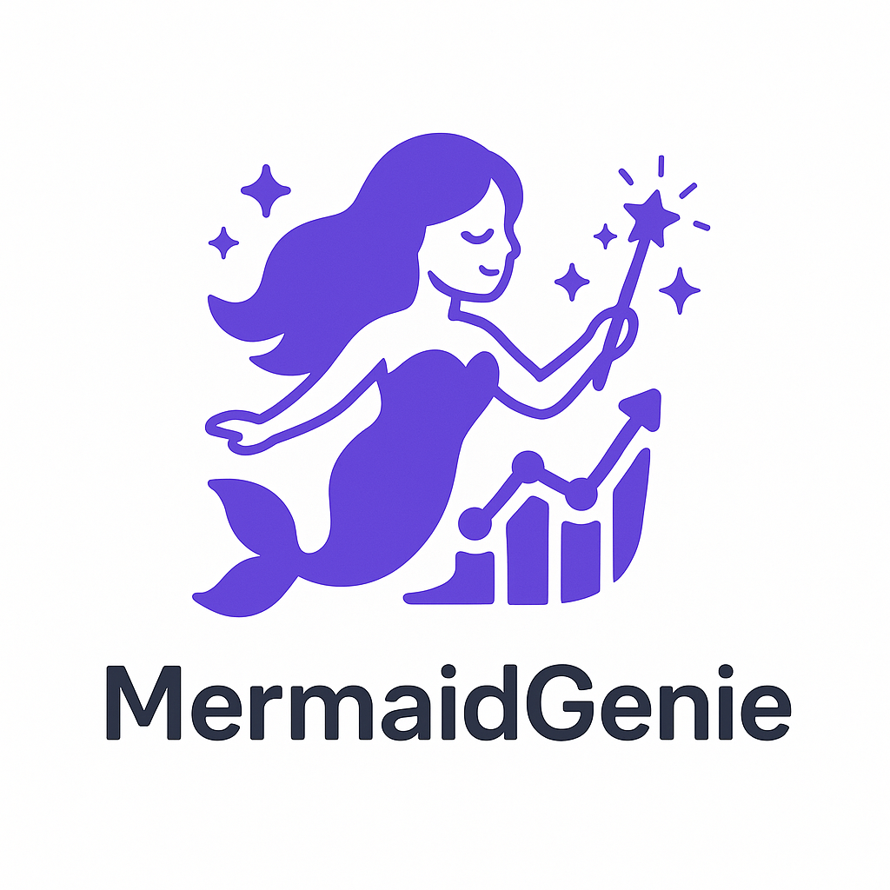
  </a>
</p>

> [!NOTE]
> Inspired by _Mermaid Live Editor_ & _Excalidraw_ — yet adds AI-powered diagram generation, secure user accounts, charts history, and secure sharing.


---

## 📋 Table of Contents

1. [About MermaidGenie](#-about-mermaidgenie)
2. [Live App](#-live-app)
3. [Features](#-features)
4. [Tech Stack & Architecture](#-tech-stack--architecture)
5. [Architecture Diagram](#-architecture-diagram)
6. [User Interface](#-user-interface)
7. [Database Schema](#-database-schema-mongoose-models)
8. [Getting Started](#-getting-started)
   - [Backend Setup](#-backend-setup)
   - [Frontend Setup](#-frontend-setup)
9. [API Reference](#-api-reference)
   - [Authentication](#authentication)
   - [Charts](#charts)
10. [Deployment](#-deployment)
11. [Scripts & Utilities](#-scripts--utilities)
12. [Testing](#-testing)
13. [CI/CD with GitHub Actions](#-cicd-with-github-actions)
14. [Docker & Containerization](#-docker--containerization)
15. [VS Code Extension](#-vs-code-extension)
16. [Contributing](#-contributing)
17. [License](#-license)
18. [Author](#-author)

## 🧜‍♂️ About MermaidGenie

MermaidGenie is a full-stack diagramming platform that converts natural-language prompts into editable Mermaid code, stores every version in MongoDB and lets you:

- generate/regenerate diagrams from natural language with AI 💡
- toggle dark/light & theme-aware exports 🌓
- collaborate by turning charts **public** or keeping them **private** 🔒
- export SVG / PNG at any size 🖼️
- edits with syntax highlighting, pan/zoom, fullscreen mode 🖌️
- and more!

Designed for developers, product managers and educators who live in Markdown and whiteboards.

## 🌐 Live App

MermaidGenie is now live on Vercel & AWS! Try it out:

👉 **[MermaidGenie](https://mermaidgenie.vercel.app)** — deploy preview on Vercel.

👉 **[OpenAPI Docs](https://mermaidgenie-api.vercel.app/api-docs)** — Swagger-UI for every endpoint.

Feel free to register an account, create charts, and explore the features. No credit card required!

## 🚀 Features

| Category                   | Highlights                                                                                 |
| -------------------------- | ------------------------------------------------------------------------------------------ |
| **Auth**                   | Register, login, JWT, reset password, email verification                                   |
| **Diagramming**            | Live Mermaid editor with syntax highlighting, AI “Regenerate” button, pan/zoom, fullscreen |
| **Asset Export**           | One-click SVG / PNG (maskable, transparent, responsive)                                    |
| **History**                | Version every regenerate/save; rollback coming soon                                        |
| **Sharing**                | Private by default — flip a switch to publish and get a share link                         |
| **PWA**                    | `manifest.json`, offline fonts, icons (512/192/32/16/ICO), splash screens                  |
| **Accessibility**          | Keyboard shortcuts, ARIA labels, color-contrast audit                                      |
| **Responsive UI**          | Tailwind + shadcn/ui, fluid between mobile & ultrawide                                     |
| **CI/CD**                  | Type-check, lint, Mocha, Chai, Jest; Docker images pushed on main                          |
| **Infrastructure-as-Code** | Terraform for AWS, Serverless Framework for backend, GitHub Actions for CI/CD              |
| **Observability**          | CloudWatch logs, Vercel Analytics, error tracking                                          |
| **Testing**                | Mocha & Chai for frontend, Jest for backend, unit/integration tests                        |

and so much more!

## 🏛 Tech Stack & Architecture

| Layer               | Tech                                                                                     |
| ------------------- | ---------------------------------------------------------------------------------------- |
| **Frontend**        | Next.js 14 App Router, React 18, TypeScript, Tailwind CSS, shadcn/ui, SWR, Framer Motion |
| **Backend**         | Node.js 18, Express 5, TypeScript, Mongoose 7, Swagger                                   |
| **Auth & Security** | bcrypt, JSON Web Tokens, Helmet, CORS                                                    |
| **AI**              | OpenAI o3 (diagram rewrite)                                                              |
| **Storage**         | MongoDB Atlas (Charts & Users), AWS S3 (future diagram screenshots)                      |
| **DevOps**          | Docker, Vercel (FE), AWS Lambda (BE), Serverless Framework, Terraform, GitHub Actions    |
| **Observability**   | CloudWatch Logs, Vercel Analytics                                                        |
| **Tests**           | Mocha & Chai (unit/integration), Jest (unit/integration)                                 |
| **IaC**             | Terraform, GitHub Actions secrets                                                        |

## 🎹 Architecture Diagram

The architecture diagram illustrates the high-level components and their interactions in the MermaidGenie application:

<p align="center">
  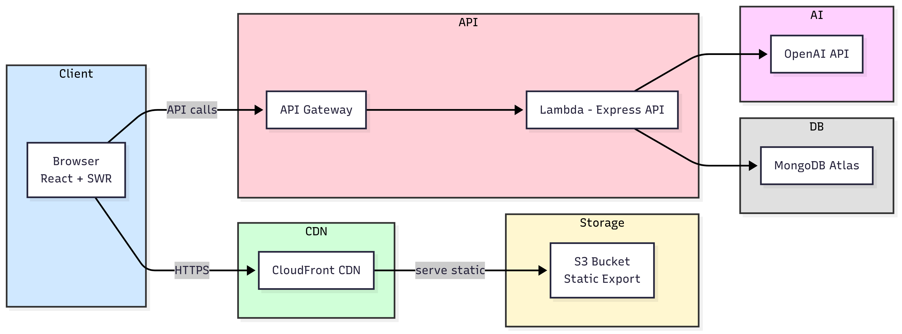
</p>

Mermaid Code for the diagram:

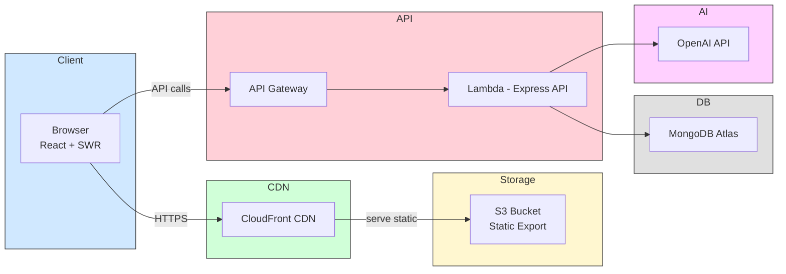

> [!TIP]
> Feel free to paste it to our own MermaidGenie editor to see and interact with it live!

## 🏗 User Interface

### Landing Page

<p align="center">
  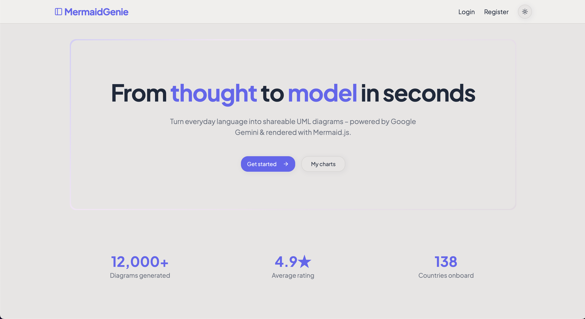
</p>

### Dashboard

<p align="center">
  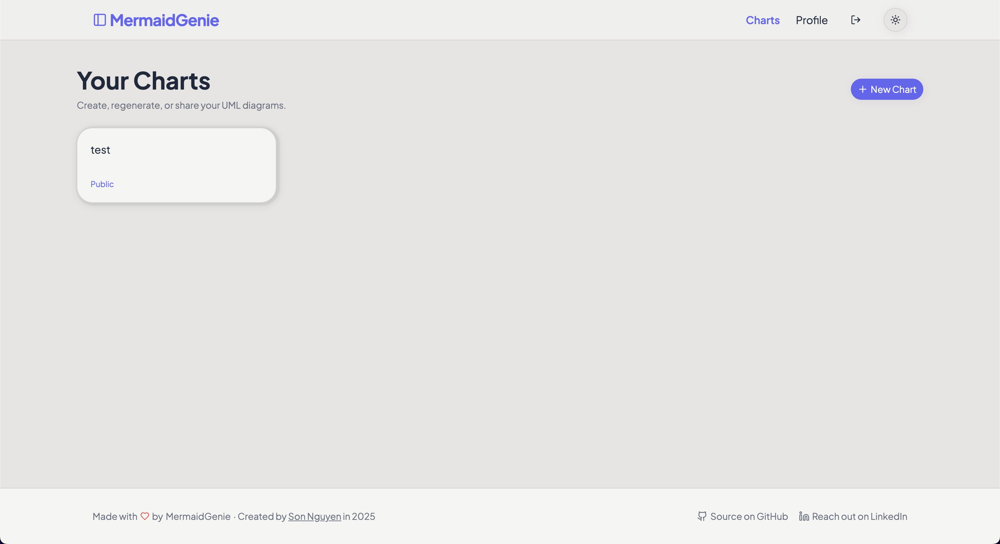
</p>

### Editor

<p align="center">
  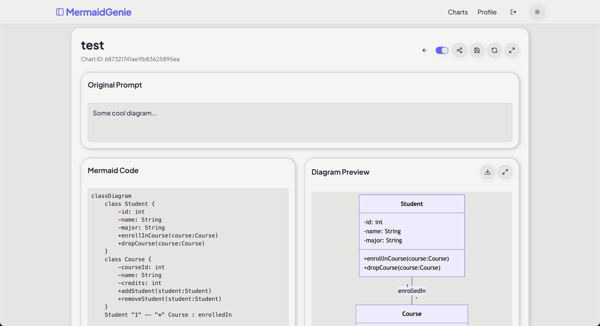
</p>

### Create Chart

<p align="center">
  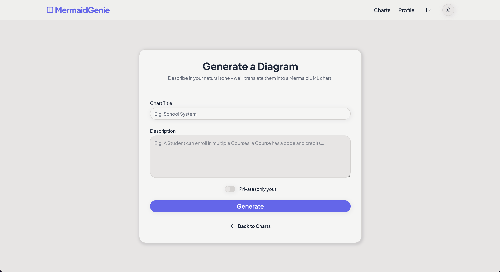
</p>

### User Profile

<p align="center">
  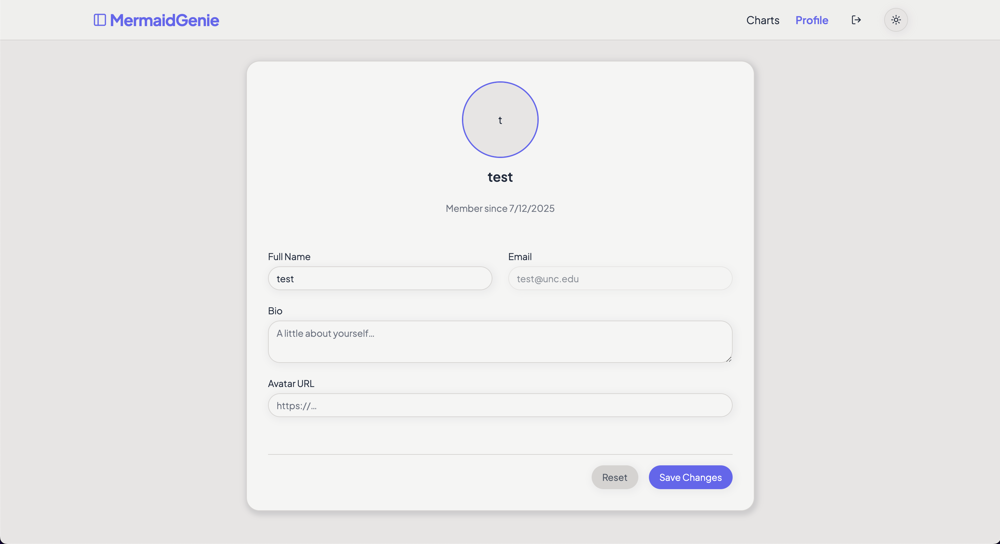
</p>

### Login

<p align="center">
  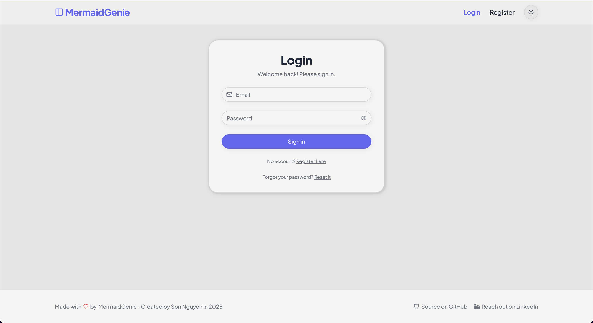
</p>

### Register

<p align="center">
  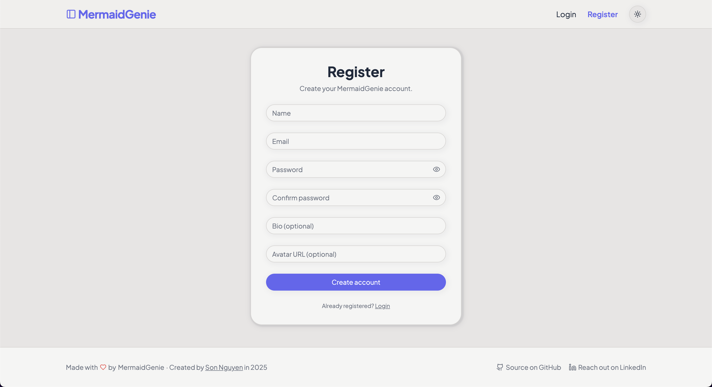
</p>

### Reset Password

<p align="center">
  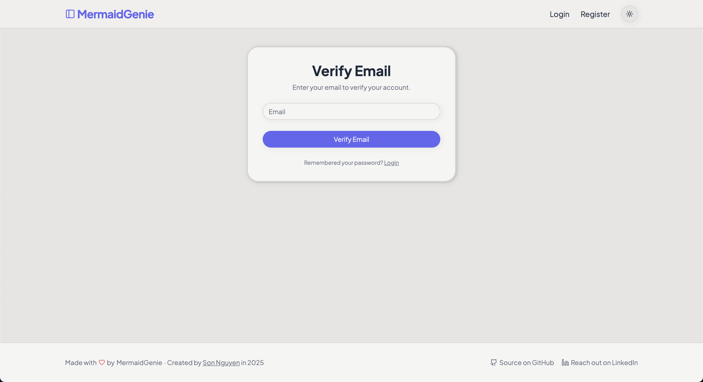
</p>

### Dark Mode Example

<p align="center">
  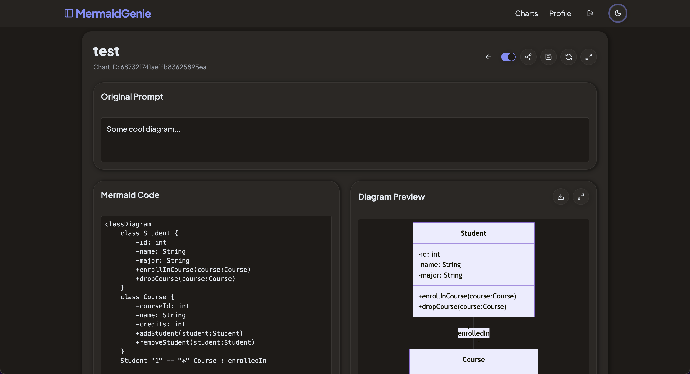
</p>

## 🗄 Database Schema (Mongoose Models)

| Model     | Field                     | Type              | Req       | Notes         |
| --------- | ------------------------- | ----------------- | --------- | ------------- |
| **User**  | `_id`                     | `ObjectId`        | ✔        |               |
|           | `name`                    | `String`          | ✔        |               |
|           | `email`                   | `String`          | ✔ unique |               |
|           | `password`                | `String`          | ✔ hashed |               |
|           | `bio`                     | `String`          | —         | optional      |
|           | `avatarUrl`               | `String`          | —         |               |
|           | `createdAt` / `updatedAt` | `Date`            | ✔        | auto          |
| **Chart** | `_id`                     | `ObjectId`        | ✔        |               |
|           | `title`                   | `String`          | ✔        |               |
|           | `prompt`                  | `String`          | ✔        | original text |
|           | `mermaidCode`             | `String`          | ✔        | sanitized     |
|           | `isPublic`                | `Boolean`         | ✔        | default false |
|           | `owner`                   | `ObjectId → User` | ✔        | ref           |
|           | `createdAt` / `updatedAt` | `Date`            | ✔        |               |

We also index `email` in `User` and `owner` in `Chart` for fast lookups.

> [!NOTE]
> Schemas may change and more schemas may be added as we implement new features. Always check the latest code in `backend/models/`.

---

## 🏁 Getting Started

### ⚙️ Backend Setup

```bash
git clone https://github.com/yourname/mermaidgenie.git
cd mermaidgenie/backend
npm install

cp .env.example .env         # fill: MONGO_URL, JWT_SECRET, OPENAI_KEY
npm run dev                  # http://localhost:5000/api or the URL with the port that you set in .env
```

### 💻 Frontend Setup

```bash
cd ../frontend
npm install --legacy-peer-deps
cp .env.local.example .env.local   # NEXT_PUBLIC_API_URL, etc.

npm run dev            # http://localhost:3000 by default
```

## 📚 API Reference

Swagger JSON at `/api-docs.json`, UI at `/api-docs`.

### Authentication

| Method   | Endpoint                   | Body                       |
| -------- | -------------------------- | -------------------------- |
| **POST** | `/api/auth/register`       | `{ name,email,password }`  |
| **POST** | `/api/auth/login`          | `{ email,password }`       |
| **POST** | `/api/auth/verify-email`   | `{ email }` → `{ exists }` |
| **POST** | `/api/auth/reset-password` | `{ email,newPassword }`    |

### Charts

| Method     | Endpoint                     | Description                        |
| ---------- | ---------------------------- | ---------------------------------- |
| **GET**    | `/api/charts`                | All charts of current user         |
| **POST**   | `/api/charts`                | Create new from `{ title,prompt }` |
| **GET**    | `/api/charts/:id`            | Fetch one (if owner or public)     |
| **PUT**    | `/api/charts/:id`            | Update prompt / code               |
| **PUT**    | `/api/charts/:id/visibility` | Toggle public                      |
| **POST**   | `/api/charts/:id/regenerate` | AI rewrite of `prompt → code`      |
| **DELETE** | `/api/charts/:id`            | Remove                             |

Authorization: `Bearer <JWT>` header (except public GET).

More details in the [OpenAPI docs](https://mermaidgenie-api.vercel.app/api-docs).

> [!NOTE]
> Additional endpoints may be added as needed for future features, so please check the API docs for the latest updates.

<p align="center">
  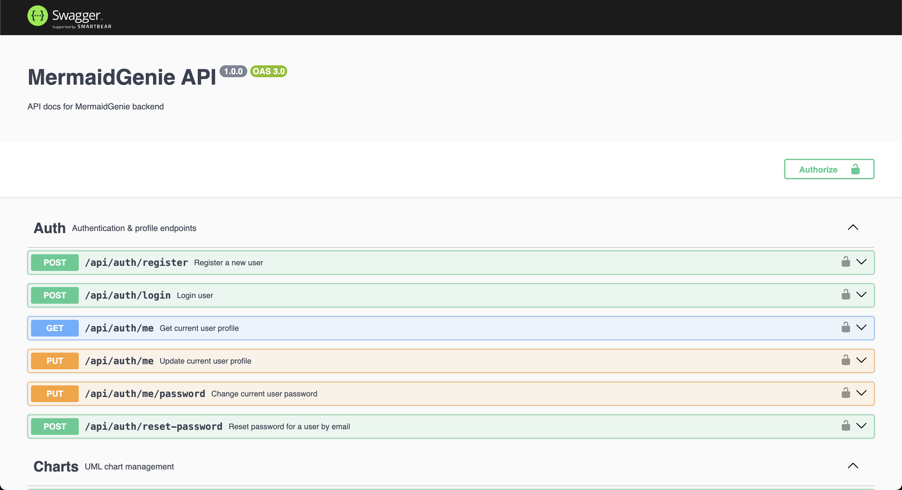
</p>

## ☁️ Deployment

MermaidGenie uses serverless and static‐hosting services:

| Layer        | Target                                      | Tool / Config                            |
| ------------ | ------------------------------------------- | ---------------------------------------- |
| **Frontend** | S3 + CloudFront global CDN                  | Terraform (in `terraform/`)              |
| **Backend**  | AWS Lambda behind HTTP API via Serverless   | Serverless Framework (in `aws/backend/`) |
| **Database** | MongoDB Atlas (M0 free / M10 prod)          | Atlas UI                                 |
| **Assets**   | S3 bucket for static export (`out/` folder) | Terraform                                |
| **Domain**   | CloudFront or Vercel custom domain (opt.)   | Route 53 / CloudFront aliases            |

**GitHub Actions workflow**

1. Install deps, type-check, lint, format
2. Build backend (`npm run build`) & frontend (`next build && next export`), errors suppressed
3. Run backend tests (Jest) & frontend tests (Mocha), errors suppressed
4. Build & push Docker images to GHCR (for both backend & frontend)
5. Run `serverless deploy --stage ${{ secrets.STAGE }}` for backend
6. Sync `frontend/out/` to S3 & invalidate CloudFront (via Terraform or AWS CLI)
7. (Optional) Vercel deploy for preview branches

_All credentials (AWS keys, Atlas URI, JWT secret, GHCR token, etc.) are stored encrypted in GitHub Secrets._

> [!TIP]
> For more details on how to deploy, check the `aws/` and `terraform/` directories for configuration files and scripts, and the [AWS deployment guide](docs/aws-deployment.md).

<p align="center">
  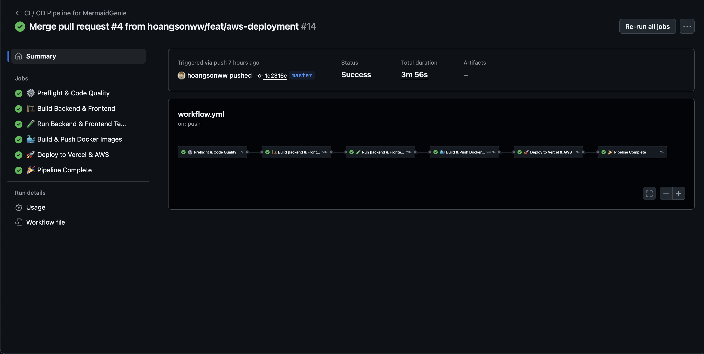
</p>

## 🛠 Scripts & Utilities

We also have several utility scripts to help with development and maintenance, as well as a Makefile for common tasks, which can be run straight from the command line in the root directory.

### Common Scripts

```bash
# Backend
./shell/backend_deploy.sh      # Deploy backend to AWS
./shell/backend_remove.sh      # Remove backend from AWS
./shell/backend_test.sh        # Run backend tests
./shell/backend_setup.sh       # Setup backend environment (e.g., MongoDB, AWS)

# Frontend
./shell/frontend_deploy.sh     # Deploy frontend to Vercel
./shell/frontend_remove.sh     # Remove frontend from Vercel
./shell/frontend_test.sh       # Run frontend tests
./shell/frontend_setup.sh      # Setup frontend environment (e.g., Vercel, Next.js)
```

### Makefile Commands

```bash
# Run all tests
make test
# Build the project
make build
# Lint the codebase
make lint
# Format the codebase
make format
# Deploy the backend
make backend-deploy
# Setup the backend environment
make backend-setup
# Test the backend
make backend-test
# Deploy the frontend
make frontend-deploy
# Setup the frontend environment
make frontend-setup
# Deploy the frontend
make deploy-frontend
# Help with available commands
make help
```

More commands and scripts can (and will) be added as needed. The Makefile is designed to simplify common tasks and ensure consistency across development environments.

## 🧪 Testing

We also have a comprehensive test suite to ensure code quality and functionality. Tests are run using Jest for the backend and Mocha/Chai for the frontend.

### Backend Tests

MermaidGenie uses Jest for unit and integration tests in the backend.

```bash
cd backend
npm run test           # Run all tests
npm run test:watch     # Watch mode
npm run test:coverage  # Generate coverage report
```

### Frontend Tests

MermaidGenie uses Mocha and Chai for unit tests in the frontend.

```bash
cd frontend
npm run test           # Run all tests
npm run test:frontend  # Run frontend tests
```

Tests are located in the `tests/` directory of each respective project. Feel free to add new tests as you develop new features or fix bugs.

## 🔄 CI/CD with GitHub Actions

MermaidGenie project uses a multi-stage CI/CD pipeline with GitHub Actions ensures code quality and deploys to Vercel and AWS.

```
.github/workflows/ci.yml
├─ Install & Cache
├─ Lint   (ESLint + Prettier)
├─ Test   (Jest & Playwright)
├─ Build  (Docker multi-arch)
├─ Push   (GHCR)
└─ Deploy (Vercel / AWS ECS)
(and more...)
```

This pipeline runs on every push to `main` and on pull requests, ensuring that only tested and linted code is deployed.

## 🐬 Docker & Containerization

MermaidGenie uses Docker for containerization, allowing for consistent development and deployment environments.

### Docker Commands

```bash
# Build the backend Docker image
docker build -t mermaidgenie-backend ./backend
# Build the frontend Docker image
docker build -t mermaidgenie-frontend ./frontend
# Run the backend container
docker run -p 5000:5000 mermaidgenie-backend
# Run the frontend container
docker run -p 3000:3000 mermaidgenie-frontend
# Push the backend image to GitHub Container Registry
docker push ghcr.io/yourusername/mermaidgenie-backend:latest
# Push the frontend image to GitHub Container Registry
docker push ghcr.io/yourusername/mermaidgenie-frontend:latest
```

### Docker Compose

We also have a `docker-compose.yml` file in the root directory for local development, which allows you to run both the backend and frontend together:

```bash
docker-compose up --build
```

This will start both services, making it easy to develop and test the entire application locally as you can get both the frontend and backend running with a single command!

### Kubernetes

For production deployments, we recommend using Kubernetes for orchestration. The Docker images can be deployed to a Kubernetes cluster, and you can use Helm charts for easier management.

We also have a `k8s/` directory with example Kubernetes manifests to get you started.

Feel free to modify these manifests to suit your production environment.

## ⚛️ VS Code Extension

MermaidGenie also comes with a VS Code extension that lets you create, edit and share Mermaid diagrams without leaving your editor.

**Key Features**

- **Instant Diagram Editor**  
  Launch MermaidGenie in a side panel via the Command Palette.
- **Live AI Generation**  
  Type natural‑language prompts and see your diagram render in real time.
- **Secure iframe**  
  Loads `https://mermaidgenie.vercel.app` under a strict Content‑Security‑Policy.
- **Persistent State**  
  Your work (prompts, edits, history) stays alive across sessions.
- **Panel Customization**  
  Configure the panel title, column, iframe size, script permissions, and auto‑open behavior.

To install the extension: Simply search for **MermaidGenie Viewer** in the VS Code Marketplace or go to [MermaidGenie Viewer](https://marketplace.visualstudio.com/items?itemName=hoangsonw.mermaidgenie-viewer) and click **Install**.

<p align="center">
  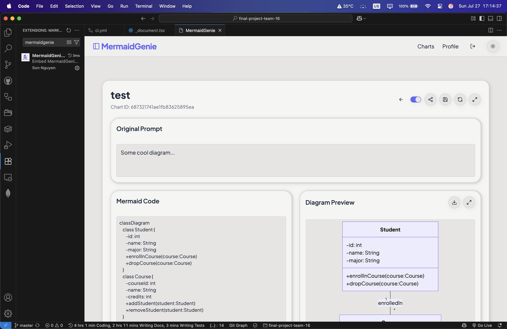
</p>

**Usage**

1. Open the **Command Palette** (`Ctrl+Shift+P` / `⌘+Shift+P`).
2. Run **MermaidGenie Viewer: Open Diagram Editor**.
3. Enter your prompt or paste Mermaid code, then edit & share.

**Configuration**
Open **Settings** → **Extensions** → **MermaidGenie Viewer** to adjust:

- Panel title
- Editor column (0=active, 1–3)
- iframe width & height
- Script permissions
- Auto‑open on startup

For full details, troubleshooting tips and advanced options, see [extension/README.md](extension/README.md).

## 🤝 Contributing

1. Fork the repo
2. Create a feature branch (`git checkout -b feature/your-feature`)
3. Make your changes
4. Before committing, run `npm run format` to format your code
5. Commit your changes with a clear message
6. Push to your fork (`git push origin feature/your-feature`)
7. Open a pull request
8. Describe your changes and link any issues
9. Wait for review and address feedback
10. Once approved, your PR will be merged!

Thanks for making diagramming better for everyone!

## 📝 License

This project is licensed under the [MIT License](LICENSE). Contributions are welcome!
However, make sure that you credit the original authors and maintainers regardless of the changes you make or the use you put it to.

## 👩‍💻 Author

Built with ☕ and 🧜 magic by **Son Nguyen** in 2025.

- GitHub: [@hoangsonww](https://github.com/hoangsonww)
- LinkedIn: [Son Nguyen](https://www.linkedin.com/in/hoangsonw/)
- Website: [https://sonnguyenhoang.com](https://sonnguyenhoang.com)

---

> [!IMPORTANT]
> **MermaidGenie** © 2025. Bring your ideas to life, one diagram at a time.
