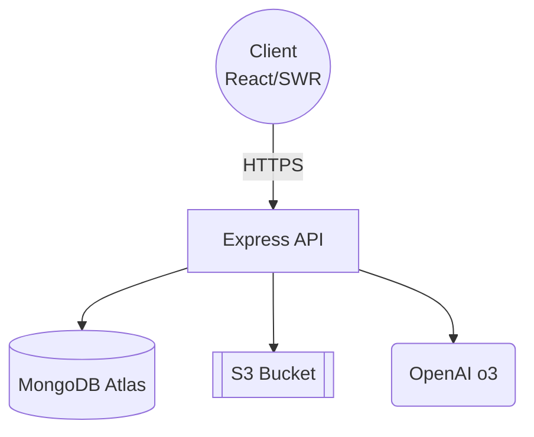

# 🧜‍♀️ MermaidGenie – Visualize Ideas in Seconds

**MermaidGenie** turns text prompts into crisp [Mermaid](https://mermaid.js.org) diagrams you can edit, version and share. Sketch flow-charts, UML, mind-maps, ERDs and more, then collaborate with teammates — all inside a sleek, PWA-ready workspace. Think “Figma for graphs”, but powered by AI. ✨

<p align="center">
  <a href="https://mermaidgenie.vercel.app" target="_blank">
    
  </a>
</p>

> [!NOTE]
> Inspired by _Mermaid Live Editor_ & _Excalidraw_ — yet adds AI-powered diagram generation, secure user accounts, charts history, and secure sharing.


---

## 📋 Table of Contents

1. [About MermaidGenie](#-about-mermaidgenie)
2. [Live App](#-live-app)
3. [Features](#-features)
4. [Tech Stack & Architecture](#-tech-stack--architecture)
5. [User Interface](#-user-interface)
6. [Database Schema](#-database-schema-mongoose-models)
7. [Getting Started](#-getting-started)

- [Backend](#-backend-setup)
- [Frontend](#-frontend-setup)

8. [API Reference](#-api-reference)
9. [Deployment](#-deployment)
10. [Scripts & Utilities](#-scripts--utilities)
11. [Testing](#-testing)
12. [CI/CD](#-cicd-with-github-actions)
13. [CLI](#-command-line-interface)
14. [Contributing](#-contributing)
15. [License](#-license)
16. [Author](#-author)

---

## 🧜‍♂️ About MermaidGenie

MermaidGenie is a full-stack diagramming platform that converts natural-language prompts into editable Mermaid code, stores every version in MongoDB and lets you:

- regenerate diagrams with AI 💡
- toggle dark/light & theme-aware exports 🌓
- collaborate by turning charts **public** or keeping them **private** 🔒
- export SVG / PNG at any size 🖼️

Designed for developers, product managers and educators who live in Markdown and whiteboards.

---

## 🌐 Live App

👉 **[MermaidGenie](https://mermaidgenie.vercel.app)** — deploy preview on Vercel.
👉 **[OpenAPI Docs](https://mermaidgenie-api.vercel.app/api-docs)** — Swagger-UI for every endpoint.

_(If the link lags Vercel cold-starts, hold tight ⏳ — or clone locally.)_

---

## 🚀 Features

| Category                   | Highlights                                                                                 |
| -------------------------- | ------------------------------------------------------------------------------------------ |
| **Auth**                   | Register, login, JWT, reset password, email verification                                   |
| **Diagramming**            | Live Mermaid editor with syntax highlighting, AI “Regenerate” button, pan/zoom, fullscreen |
| **Asset Export**           | One-click SVG / PNG (maskable, transparent, responsive)                                    |
| **History**                | Version every regenerate/save; rollback coming soon                                        |
| **Sharing**                | Private by default — flip a switch to publish and get a share link                         |
| **PWA**                    | `manifest.json`, offline fonts, icons (512/192/32/16/ICO), splash screens                  |
| **Accessibility**          | Keyboard shortcuts, ARIA labels, color-contrast audit                                      |
| **Responsive UI**          | Tailwind + shadcn/ui, fluid between mobile & ultrawide                                     |
| **CI/CD**                  | Type-check, lint, Playwright, Jest; Docker images pushed on main                           |
| **Infrastructure-as-Code** | Terraform modules for S3, ECS, Route 53; GitHub Actions deploy                             |

---

## 🏛 Tech Stack & Architecture

| Layer               | Tech                                                                                     |
| ------------------- | ---------------------------------------------------------------------------------------- |
| **Frontend**        | Next.js 14 App Router, React 18, TypeScript, Tailwind CSS, shadcn/ui, SWR, Framer Motion |
| **Backend**         | Node.js 18, Express 5, TypeScript, Mongoose 7, Swagger                                   |
| **Auth & Security** | bcrypt, JSON Web Tokens, Helmet, CORS                                                    |
| **AI**              | OpenAI o3 (diagram rewrite)                                                              |
| **Storage**         | MongoDB Atlas (Charts & Users), AWS S3 (future diagram screenshots)                      |
| **DevOps**          | Docker, Vercel (FE), AWS ECS + Fargate (BE), GitHub Actions                              |
| **Observability**   | CloudWatch Logs, Vercel Analytics                                                        |
| **Tests**           | Playwright (E2E), Jest (unit/integration)                                                |
| **IaC**             | Terraform, GitHub Actions secrets                                                        |



<p align="center">
  
</p>

---

## 🏗 User Interface

<p align="center">
  
</p>

<p align="center">
  
</p>

_(Screenshots in `docs/img/` — replace with yours.)_

---

## 🗄 Database Schema (Mongoose Models)

| Model     | Field                     | Type              | Req       | Notes         |
| --------- | ------------------------- | ----------------- | --------- | ------------- |
| **User**  | `_id`                     | `ObjectId`        | ✔        |               |
|           | `name`                    | `String`          | ✔        |               |
|           | `email`                   | `String`          | ✔ unique |               |
|           | `password`                | `String`          | ✔ hashed |               |
|           | `bio`                     | `String`          | —         | optional      |
|           | `avatarUrl`               | `String`          | —         |               |
|           | `createdAt` / `updatedAt` | `Date`            | ✔        | auto          |
| **Chart** | `_id`                     | `ObjectId`        | ✔        |               |
|           | `title`                   | `String`          | ✔        |               |
|           | `prompt`                  | `String`          | ✔        | original text |
|           | `mermaidCode`             | `String`          | ✔        | sanitized     |
|           | `isPublic`                | `Boolean`         | ✔        | default false |
|           | `owner`                   | `ObjectId → User` | ✔        | ref           |
|           | `createdAt` / `updatedAt` | `Date`            | ✔        |               |

_(Indexes on `email`, compound `{ owner, _id }` for fast lookups.)_

---

## 🏁 Getting Started

### ⚙️ Backend Setup

```bash
git clone https://github.com/yourname/mermaidgenie.git
cd mermaidgenie/backend
npm install

cp .env.example .env         # fill: MONGO_URL, JWT_SECRET, OPENAI_KEY
npm run dev                  # http://localhost:5000/api or the URL with the port that you set in .env
```

### 💻 Frontend Setup

```bash
cd ../frontend
npm install --legacy-peer-deps
cp .env.local.example .env.local   # NEXT_PUBLIC_API_URL, etc.

npm run dev            # http://localhost:3000 by default
```

### 🐋 Docker All-in-One

```bash
docker compose up --build
# FE on :3000, BE on :5000
```

---

## 📚 API Reference

Swagger JSON at `/api-docs.json`, UI at `/api-docs`.

### Authentication

| Method   | Endpoint                   | Body                       |
| -------- | -------------------------- | -------------------------- |
| **POST** | `/api/auth/register`       | `{ name,email,password }`  |
| **POST** | `/api/auth/login`          | `{ email,password }`       |
| **POST** | `/api/auth/verify-email`   | `{ email }` → `{ exists }` |
| **POST** | `/api/auth/reset-password` | `{ email,newPassword }`    |

### Charts

| Method     | Endpoint                     | Description                        |
| ---------- | ---------------------------- | ---------------------------------- |
| **GET**    | `/api/charts`                | All charts of current user         |
| **POST**   | `/api/charts`                | Create new from `{ title,prompt }` |
| **GET**    | `/api/charts/:id`            | Fetch one (if owner or public)     |
| **PUT**    | `/api/charts/:id`            | Update prompt / code               |
| **PUT**    | `/api/charts/:id/visibility` | Toggle public                      |
| **POST**   | `/api/charts/:id/regenerate` | AI rewrite of `prompt → code`      |
| **DELETE** | `/api/charts/:id`            | Remove                             |

Authorization: `Bearer <JWT>` header (except public GET).

---

## ☁️ Deployment

| Layer        | Target                                | Tool                       |
| ------------ | ------------------------------------- | -------------------------- |
| **Frontend** | Vercel edge network                   | `vercel.json`              |
| **Backend**  | AWS ECS Fargate                       | Terraform + GitHub Actions |
| **Database** | MongoDB Atlas (M0 free ✅ / M10 prod) | Atlas UI                   |
| **Assets**   | S3 static bucket (`public/`)          | Terraform                  |
| **Domain**   | Cloudflare → Vercel / ALB             | Route 53 optional          |

GitHub Actions workflow:

1. Install, type-check, lint
2. Jest + Playwright
3. Build Docker (`ghcr.io/…`)
4. `aws ecs update-service --force-new-deployment`
5. `vercel deploy --prod`

Secrets live in **GH Actions** → Encrypted.

---

## 🛠 Scripts & Utilities

```bash
# backend
npm run dev          # nodemon ts-node
npm run build        # tsc
npm run lint         # eslint
npm run seed         # load sample charts

# frontend
npm run dev          # next dev
npm run build        # next build
npm run export       # static export
```

Make targets in `/Makefile` for CI convenience.

---

## 🧪 Testing

| Layer   | Tool                             | Command            |
| ------- | -------------------------------- | ------------------ |
| FE E2E  | **Playwright**                   | `npm run test:e2e` |
| FE unit | **Jest + React Testing Library** | `npm run test`     |
| BE      | **Jest / supertest**             | `npm run test`     |

Playwright records video & traces; artifacts uploaded to GH Actions.

---

## 🔄 CI/CD with GitHub Actions

```
.github/workflows/ci.yml
├─ Install & Cache
├─ Lint   (ESLint + Prettier)
├─ Test   (Jest & Playwright)
├─ Build  (Docker multi-arch)
├─ Push   (GHCR)
└─ Deploy (Vercel / AWS ECS)
```

Fail-fast matrix keeps the main branch green.

---

## ⚙️ Command Line Interface

```bash
mermaidgenie <cmd>

Options:
  dev            # start FE & BE concurrently
  db:seed        # populate sample data
  chart:export   # dump all charts as SVGs
  lint           # run eslint & prettier
  test           # run all tests
```

Implemented in `cli.ts` (Node yargs).

---

## 🤝 Contributing

1. Fork → branch → PR
2. Conventional commits (`feat:`, `fix:` …) enforced by Husky + Commitlint
3. `npm run format` before pushing

Thanks for making diagramming better for everyone!

---

## 📝 License

This project is licensed under the [MIT License](LICENSE). Contributions are welcome!
However, make sure that you credit the original authors and maintainers regardless of the changes you make or the use you put it to.

---

## 👩‍💻 Author

Built with ☕ and 🧜 magic by **Son Nguyen** in 2025.

- GitHub: [@hoangsonww](https://github.com/hoangsonww)
- LinkedIn: [Son Nguyen](https://www.linkedin.com/in/hoangsonw/)
- Website: [https://sonnguyenhoang.com](https://sonnguyenhoang.com)

---

> [!IMPORTANT]
> **MermaidGenie** © 2025. Bring your ideas to life, one diagram at a time.
